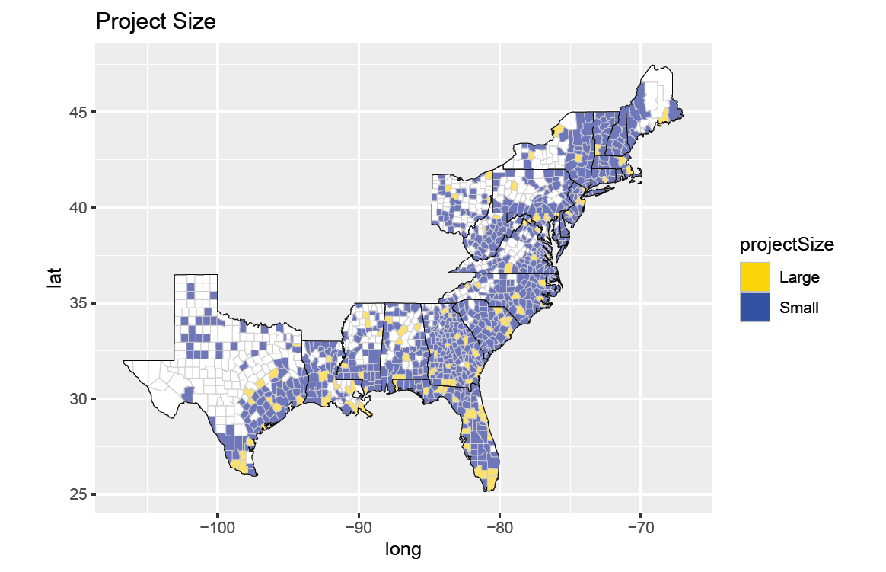
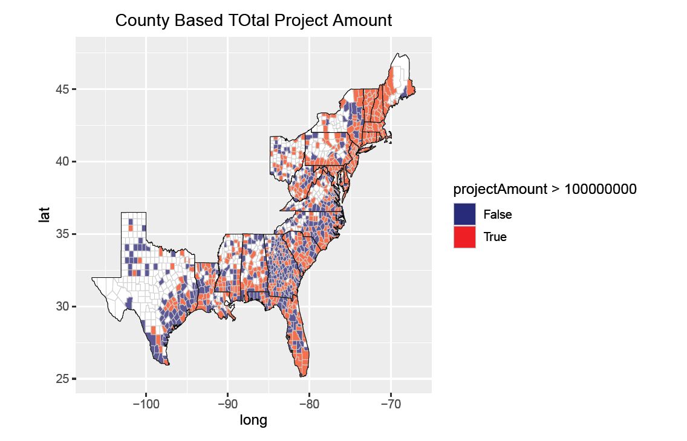

```{r setup, include=FALSE}
suppressPackageStartupMessages(
  library(tidyverse))
  library(lubridate)
  library(dplyr)
  library(magrittr)
  library(usmap)
  library(maps)
  library(knitr)


  library(gutenbergr)
  opts_chunk$set(
  comment = "#>",
  collapse = TRUE,
  cache = TRUE,
  warning = FALSE,
  message = FALSE,
  echo = TRUE,
  dpi = 300,
  cache.lazy = FALSE,
  tidy = "styler",
  out.width = "90%",
  fig.align = "center",
  fig.width = 5,
  fig.height = 7
)

  options(crayon.enabled = FALSE)

  theme_set(theme_light())

```

# Public Assistance Funded Projects Details Dataset


<h4>This dataset contains obligated (financial obligation to grantee) Public Assistance projects, lists public assistance recipients designated as applicants in the data, and a list of every funded, individual project, called project worksheets. </h4>

<div style="font-size:24pt; font-weight:bold">
```{r import}
# import data 
data <- read.csv("PublicAssistanceFundedProjectsDetails.csv",header=TRUE)
```
```{r}
list(data,n=5)
```
</div>

# Data Cleaning and Organization
I focus on the hurricane incident data from year 2009 to 2018. 
<div style="font-size:15pt; font-weight: bold">
```{r filter}
data <- data %>% filter(incidentType == "Hurricane") 
data$declarationDate <- ymd_hms(data$declarationDate)
data <- data %>% filter(2009 <= year(data$declarationDate)) 
data <- data %>% filter(year(data$declarationDate) <= 2018)
head(data, n=3)
```
</div>

# Data Cleaning and Organization
<div style="font-size:15pt">
Choose the needed columns from 'data'

Join the resulting table with < map_data "county"> and match the latitude and longitude of the counties in my table.

Correct some counties' names and filter out NAs

```{r join, echo=FALSE,result=FALSE}
myState <- tolower(unique(data$state))
county <- tolower(unique(data$county))

MainStates <- map_data("state",myState)
AllCounty <- map_data("county",myState)
```
```{r}
# select columns I need 
cTable <- data%>%select("declarationDate","county","countyCode","state","projectSize","projectAmount","federalShareObligated","totalObligated")
```

```{r clean, echo=FALSE,result=FALSE}
# get a new table contains projectTotal
sumProject <- cTable %>% group_by(countyCode) %>% dplyr::summarise(projectTotal = sum(projectAmount))

# merge cTable and projectTotal
cTable <- merge(sumProject,cTable,by = "countyCode")

cTable %<>% dplyr::rename(region=state, subregion=county)
cTable$region %<>% tolower()
cTable$subregion %<>% tolower()

# correct those counties' names which contain " (city)"
cTable$subregion <- gsub("\\ \\(city\\)","",cTable$subregion)

```
```{r}
# join the table with Allcounty to match latitude and longitude
# filter out miss-matched rows
cTable <- left_join(cTable,AllCounty,by = "subregion")
cTable %<>% filter(long != "NA")
```

```{r ifelse, echo=FALSE,result=FALSE}
# find which counties have project amount greater than 100 million.
cTable %<>% mutate(`projectAmount > 100000000` = ifelse(cTable$projectTotal > 100000000, "True", "False"))
```
</div>

# Resulting Table
<div style="font-size:15pt">
There are 22 distinct States and 525 counties after joining and matching the tables.
```{r show}
length(unique(cTable$region.x))

length(unique(cTable$subregion))

list(cTable,n=10)
```
</div>

# Mapping 1
<div style="font-size:12pt">

Projects are designated as Large or Small, which can affect a number of variables in case management (processing). Project size is determined by the eligible amount as set in the damage survey.

This map shows the distribution of the project size over the States

<p>
</p>


</div>

# Mapping 2

<div style="font-size:12pt">
Project Amount is the estimated total cost of the Public Assistance grant project in dollars, without administrative costs. This amount is based on the damage survey.

This map shows whether or not the Total project amount grouped by county is over 100 million or not.

<p>
</p>


</div>